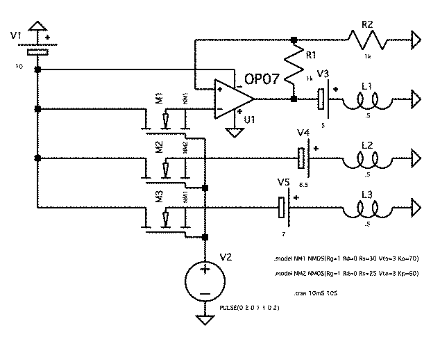

# OVERVIEW

The following are provided,
in the hope that they may benefit those making the reformation to **C**.

- The basic mathematics behind a projectile launch mechanism,
	presuming said mechanism is compliant with the following:

	**Work must be proportional to power.**

- A boilerplate for tasks a robot must complete once, and multiple times.
- A straightforward methor for receiving and executing tasks for the robot.
- A demonstration of a full implementation of the above,
	for 35473D microprocessor architecture,
	using a controller area network compatible motor system.
- A circuit diagram for said implementation:

	

## USEAGE

A file, like `demo.c` and `aim.c` herein,
should be written and linked.
To do this is simple:

```sh
gcc main.c -o main.o
gcc demo.c -o demo.o
gcc main.o demo.o
```

## EXTERNAL FUNCTIONS

This library expects three external functions to be provided:
`aim` `rcv` and `auton`.
These, respectively, should be a series of commands,
returning 0 on success,
and a method to assign commands and targets,
taking the addresses for it's ouput,
and returning 0 on success.

## OPERATION

`start` creates the connection with the robot,
and returns the result of `auton` provided.

`run` is repeatedly executed every `R_FQ` microseconds,
and will execute the command with highest importance,
and on success, direct the robot to the target.

Commands are received using the `rcv` command,
as are targets.

The provided `main` function sets up a socket connection
with the *Linux* `socketcan` library.
Those not using *Linux* should [install it now](https://www.linux.org/pages/download/).
